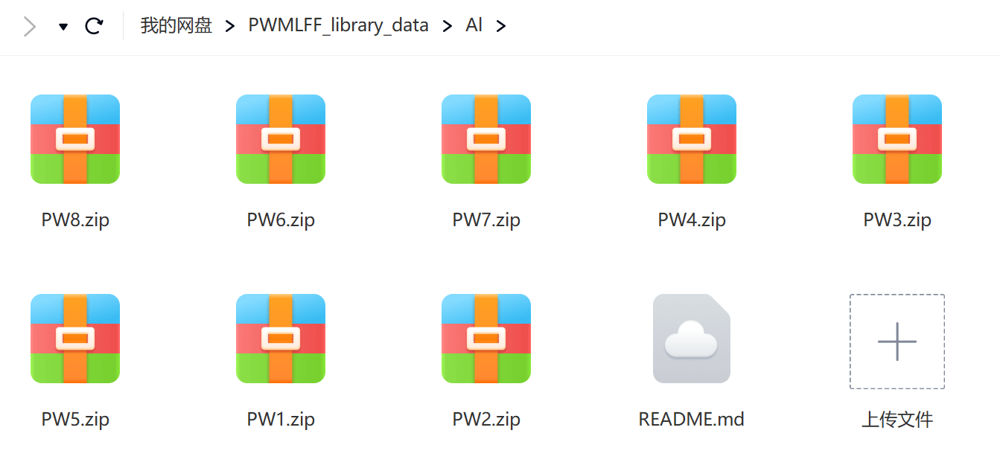

**summary**

      This directory includes 24443 images of Al system. The data cloud drive link is 

**The data cloud drive link**

      https://pan.baidu.com/s/1FMH_EwiCwfMLOIOlk9e1Ug?pwd=8lg5 
   
      Extracted code 8lg5

   You could also scan this QR code to download.

   
   

**PW1**

      4786 images (32 atoms) dynamics temperature 300K
    
**PW2**

      5468 images (32 atoms) dynamics temperature 300K
    
**PW3**

      4339 images (32 atoms) dynamics temperature 300K
    
**PW4**

      4972 images (32 atoms) dynamics temperature 300K
    
**PW5**

      1193 images (32 atoms) dynamics temperature 300K
    
**PW6**

      1364 images (32 atoms) dynamics temperature 500K
    
**PW7**

      1081 images (32 atoms) dynamics temperature 800K
    
**PW8**

      1240 images (32 atoms) dynamics temperature 1000K
    

**PWmat version** 
    
    ***

**etot.input**

    ***

**MD initial configuration**

