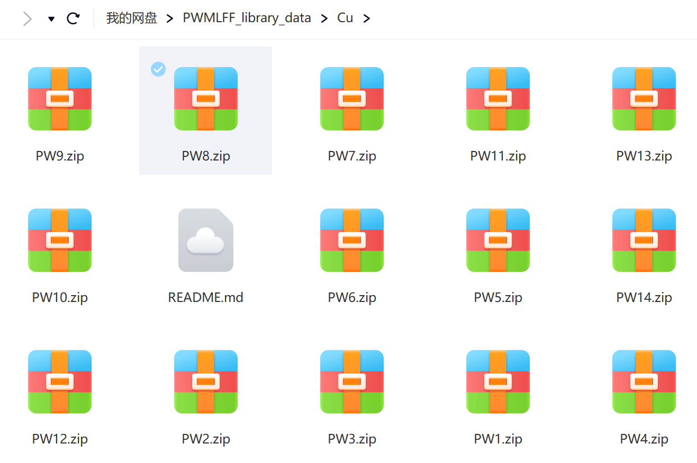

**summary**

      This directory includes 72076 images of Cu system. 
   
[**The data cloud drive link**](https://pan.baidu.com/s/1ZEOuPl2P6V9nE7czYScAAg?pwd=pwmt)

```
https://pan.baidu.com/s/1ZEOuPl2P6V9nE7czYScAAg?pwd=pwmt
```
   
You could also scan this QR code to download.

   
   
<div align="left">

</div>

**PW1**
   
      687 images(108 atoms);   dynamics temperature 800K

**PW10**
   
      10000 images(108 atoms); dynamics temperature 600K

**PW11**
   
      10000 images(108 atoms); dynamics temperature 700K

**PW12**
   
      4743 images(108 atoms);  dynamics temperature 600K

**PW13**
   
      10000 images(108 atoms); dynamics temperature 800K

**PW14**
   
      1646 images(108 atoms);  dynamics temperature 800K

**PW2**
   
      1000 images(108 atoms);  dynamics temperature 800K

**PW3**
   
      1000 images(108 atoms);  dynamics temperature 600K

**PW4**
   
      1000 images(108 atoms);  dynamics temperature 400K

**PW5**
   
      1000 images(108 atoms);  dynamics temperature 500K

**PW6**
   
      1000 images(108 atoms);  dynamics temperature 600K

**PW7**
   
      10000 images(108 atoms); dynamics temperature 600K

**PW8**
   
      10000 images(108 atoms); dynamics temperature 400K

**PW9**
   
      10000 images(108 atoms); dynamics temperature 600K


**PWmat version** 
    
    ***

**etot.input**

    ***

**MD initial configuration**


# **models**

We provide models trained with different optimizers, batch sizes, and GPU configurations.

Due to limitations on GitHub, we have only uploaded models with batch sizes of 1, 16, and 32. For the `complete set of model data, please visit the corresponding Baidu Netdisk link for downloading`.

For example:
```
LKF_bs512_t1/
------------/best.pth.tar
------------/checkpoint.pth.tar
------------/dp_torch2_best.cpkt
------------/dp_torch2.cpkt
------------/epoch_train.dat
------------/epoch_valid.dat
------------/train_loss.png
```
Here, `"LKF"` refers to using the `RLEKF optimizer`, and `"adam"` indicates training using the `Adam optimizer`. 

`"bs512"` represents a `batch_size` of `512`.

In directories that contain "GPU" in their names, the number following "GPU" indicates the number of GPUs used. Please note that` multi-GPU training has not been added to the PWMLFF2024.3 version yet`.

Regarding the model names, if the name is `"best.pth.tar"` or `"checkpoint.pth.tar"`, it means that the model was `trained using an earlier version` of PWMLFF that is no longer supported in the new version. We provide model conversion, and the corresponding converted model names are `"dp_torch2_best.cpkt"` and `"dp_torch2.cpkt"`.

Models with `"best"` in their names indicate the model with the `lowest validation loss` during the training process, while others represent the model at the end of the last epoch.

`"train_loss.png"` shows the decreasing trend of the training loss during model training. The data is sourced from the `"epoch_train.dat"` file in the same directory. Since the validation loss is only saved for the last epoch, it is written below the title instead of being plotted on the graph.
