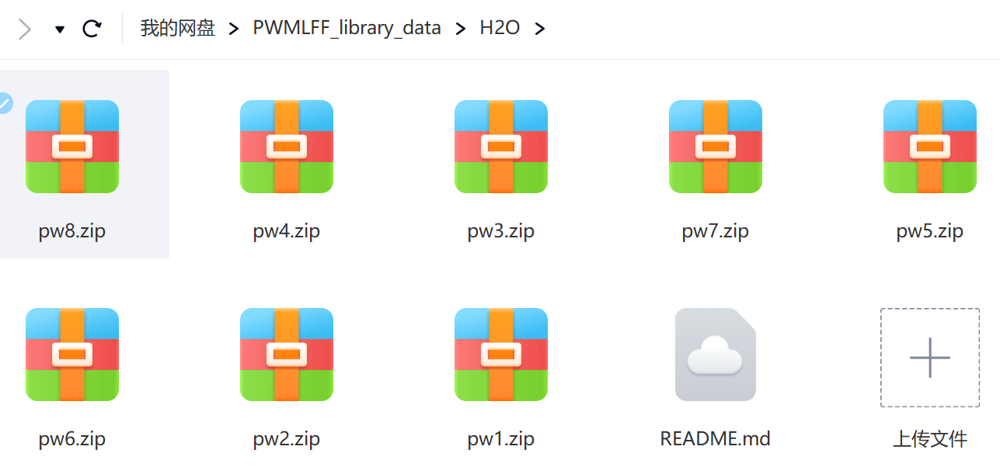

**summary**

      This directory includes 28018 images of H2O system. 
   
**The data cloud drive link**

      https://pan.baidu.com/s/1JlyDrA31AgsPFy6YAQDkDA?pwd=5csr  
   
      Extracted code 5csr

   You could also scan this QR code to download.

   

**pw1**

   4908 images(48 atoms) dynamics temperature 300K

   
**pw2**

   5696 images(48 atoms) dynamics temperature 500K

   
**pw3**

   6028 images(48 atoms) dynamics temperature 800K

   
**pw4**

   5944 images(48 atoms) dynamics temperature 1000K

   
**pw5**

   1225 images(48 atoms) dynamics temperature 300K

   
**pw6**

   1226 images(48 atoms) dynamics temperature 300K

   
**pw7**

   1506 images(48 atoms) dynamics temperature 800K

   
**pw8**

   1485 images(48 atoms) dynamics temperature 1000K

**PWmat version** 
    
    ***

**etot.input**

    ***

**MD initial configuration**

