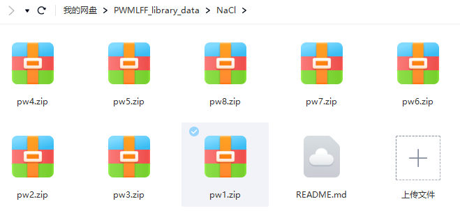

**summary**

      This directory includes 39987 images of NaCl system. 
      
[**The data cloud drive link**](https://pan.baidu.com/s/1oq6DSmxDUCiPrwW5_z6pOg?pwd=pwmt)

```
https://pan.baidu.com/s/1oq6DSmxDUCiPrwW5_z6pOg?pwd=pwmt
```
         
   You can also scan the code to download.
   
   
   

<div align="left">

</div>

**pw1**

      7997 images(64 atoms) dynamics temperature 300K
   
**pw2**

      7997 images(64 atoms) dynamics temperature 500K
   
**pw3**

      7997 images(64 atoms) dynamics temperature 800K
   
**pw4**

      7996 images(64 atoms) dynamics temperature 1000K
   
**pw5**

      2000 images(64 atoms) dynamics temperature 300K
   
**pw6**

      2000 images(64 atoms) dynamics temperature 500K
   
**pw7**

      2000 images(64 atoms) dynamics temperature 800K
   
**pw8**

      2000 images(64 atoms) dynamics temperature 1000K
   

**PWmat version** 
    
      ***

**etot.input**

      ***

**MD initial configuration**
