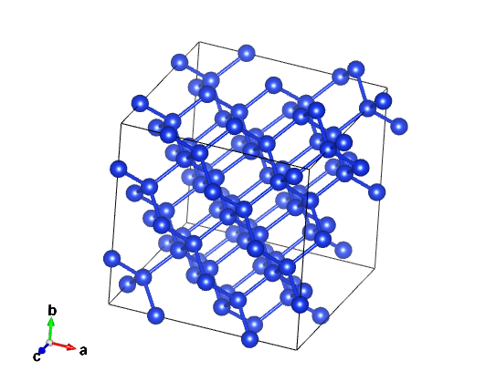

# download
[**The data cloud drive link**](https://pan.baidu.com/s/1vYthAP7ztUvlob1m6No_jQ?pwd=pwmt)

```
https://pan.baidu.com/s/1vYthAP7ztUvlob1m6No_jQ?pwd=pwmt
```
You could also scan this QR code to download.

   

# Si_4600images

**summary**:
    
    This directory includes the AIMD trajectories of the Si bulk 64 atomic system at temperatures of 500K(600 images), 800K(1000 images), 900K(1000 images), 1100K(1000 images), and 1300K(1000 images).


**PWmat version**: 
    
    20230418

**etot.input**:

    1 1
    in.atom = atom.config
    IN.PSP1 = Si.SG15.PBE.UPF
    Ecut = 50
    Ecut2 = 200
    job = md
    
    md_detail = 2, 600, 2.0, 500.000000, 500.000000 #for 500k data
    md_detail = 2, 1000, 2.0, 800.000000, 800.000000 #for 800k data
    md_detail = 2, 1000, 2.0, 900.000000, 900.000000 #for 900k data
    md_detail = 2, 1000, 2.0, 1100.000000, 1100.000000 #for 1100k data
    md_detail = 2, 1000, 2.0, 1300.000000, 1300.000000 #for 1300k data

    mp_n123 = 1 1 1 0 0 0 2
    xcfunctional = GGA
    E_error = 0
    Rho_error = 1E-5
    SCF_ITER0_1 =    6   4    3    0.0000     0.02 2
    SCF_ITER0_2 =   94   4    3    1.0000     0.02 2
    SCF_ITER1_1 =   40   4    3    1.0000     0.02 2

    OUT.WG = F 
    OUT.RHO = F 
    OUT.VR = F 
    OUT.FORCE = T 
    OUT.STRESS = T 
    OUT.MLMD = T
    ENERGY_DECOMP = T, 1


structure:



# Si_39988images

**summary**

      This directory includes 39988 images of Si system. 

**pw1**

   7997 images (72 atoms); molecular dynamics temperature  300K 


**pw2**

   7997 images (72 atoms); molecular dynamics temperature  500K 


**pw3**

   7997 images (72 atoms); molecular dynamics temperature  800K 


**pw4**

   7997 images (72 atoms); molecular dynamics temperature  1000K 


**pw5**

   2000 images (72 atoms); molecular dynamics temperature  300K 


**pw6**

   2000 images (72 atoms); molecular dynamics temperature  500K 


**pw7**

   2000 images (72 atoms); molecular dynamics temperature  800K 


**pw8**

   2000 images (72 atoms); molecular dynamics temperature  1000K 


**PWmat version** 
    
   20221214

**etot.input**

    ***

# **models**

We provide models trained with different optimizers, batch sizes, and GPU configurations.

Due to limitations on GitHub, we have only uploaded models with batch sizes of 1, 16, and 32. For the `complete set of model data, please visit the corresponding Baidu Netdisk link for downloading`.

For example:
```
LKF_bs512_t1/
------------/best.pth.tar
------------/checkpoint.pth.tar
------------/dp_torch2_best.cpkt
------------/dp_torch2.cpkt
------------/epoch_train.dat
------------/epoch_valid.dat
------------/train_loss.png
```
Here, `"LKF"` refers to using the `RLEKF optimizer`, and `"adam"` indicates training using the `Adam optimizer`. 

`"bs512"` represents a `batch_size` of `512`.

In directories that contain "GPU" in their names, the number following "GPU" indicates the number of GPUs used. Please note that` multi-GPU training has not been added to the PWMLFF2024.3 version yet`.

Regarding the model names, if the name is `"best.pth.tar"` or `"checkpoint.pth.tar"`, it means that the model was `trained using an earlier version` of PWMLFF that is no longer supported in the new version. We provide model conversion, and the corresponding converted model names are `"dp_torch2_best.cpkt"` and `"dp_torch2.cpkt"`.

Models with `"best"` in their names indicate the model with the `lowest validation loss` during the training process, while others represent the model at the end of the last epoch.

`"train_loss.png"` shows the decreasing trend of the training loss during model training. The data is sourced from the `"epoch_train.dat"` file in the same directory. Since the validation loss is only saved for the last epoch, it is written below the title instead of being plotted on the graph.

