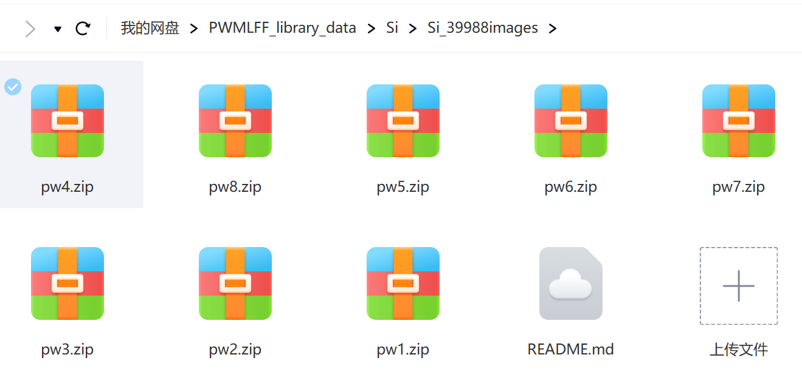

**summary**

      This directory includes 39988 images of Si system. 
   
**The data cloud drive link**

      https://pan.baidu.com/s/1oP6WvMBjx10-X7bt3vi6rA?pwd=o9cr  
   
      Extracted code o9cr

   You could also scan this QR code to download.

   

**pw1**

   7997 images (72 atoms); molecular dynamics temperature  300K 

**pw2**

   7997 images (72 atoms); molecular dynamics temperature  500K 

**pw3**

   7997 images (72 atoms); molecular dynamics temperature  800K 

**pw4**

   7997 images (72 atoms); molecular dynamics temperature  1000K 

**pw5**

   2000 images (72 atoms); molecular dynamics temperature  300K 

**pw6**

   2000 images (72 atoms); molecular dynamics temperature  500K 

**pw7**

   2000 images (72 atoms); molecular dynamics temperature  800K 

**pw8**

   2000 images (72 atoms); molecular dynamics temperature  1000K 

**PWmat version** 
    
   20221214

**etot.input**

    ***

**MD initial configuration**

